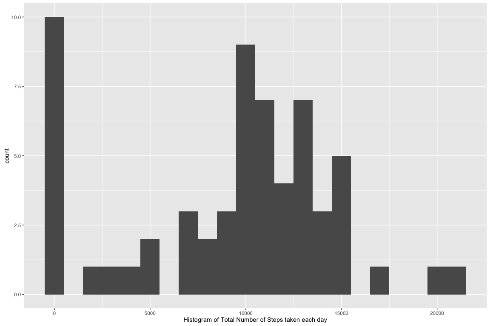
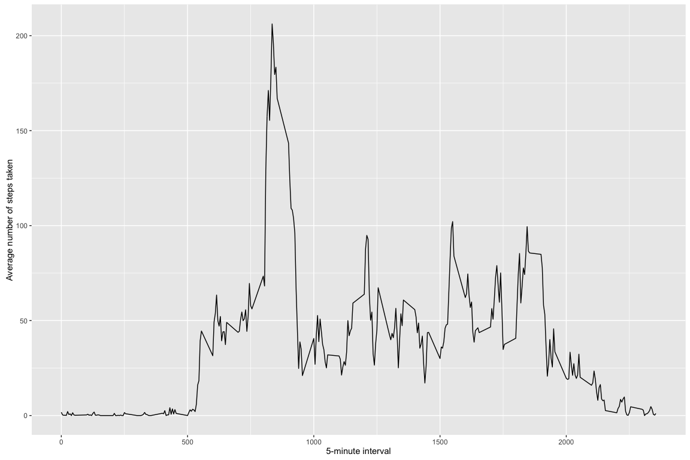
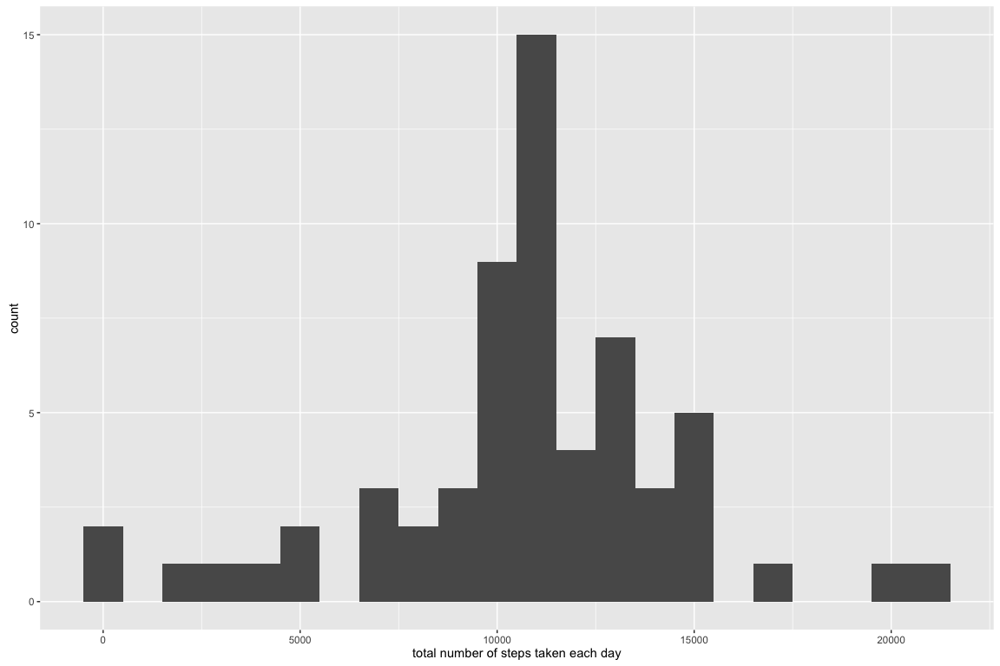
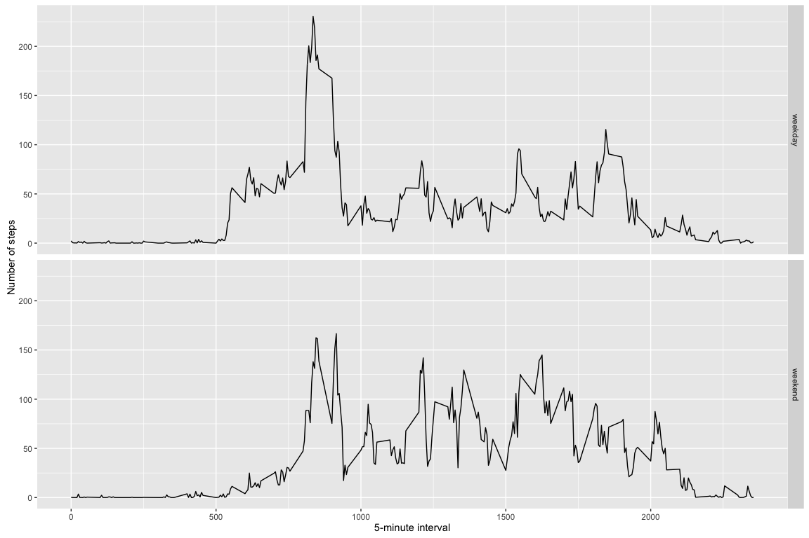

# Reproducible Research: Peer Assessment 1


## Loading and preprocessing the data

```r
unzip(zipfile="activity.zip")
data <- read.csv("activity.csv")
```


## What is mean total number of steps taken per day?

```r
library(ggplot2)
totalnoofsteps <- tapply(data$steps, data$date, FUN=sum, na.rm=TRUE)
qplot(totalnoofsteps, binwidth=1000, xlab="Histogram of Total Number of Steps taken each day")
```



```r
meanoftotalnoofsteps <- as.integer(mean(totalnoofsteps, na.rm=TRUE))
mediantotalnoofsteps <- as.integer(median(totalnoofsteps, na.rm=TRUE))
```

Mean of Total Number of Steps : 9354  
Median of Total Number of Steps : 10395


## What is the average daily activity pattern?

```r
library(ggplot2)
averages <- aggregate(x=list(steps=data$steps), by=list(interval=data$interval),
                      FUN=mean, na.rm=TRUE)
ggplot(data=averages, aes(x=interval, y=steps)) +
    geom_line() +
    xlab("5-minute interval") +
    ylab("Average number of steps taken")
```


Maximum number average steps across all the days for the 5-minute interval :

```r
averages[which.max(averages$steps),]
```

```
##     interval    steps
## 104      835 206.1698
```

## Imputing missing values
Note that there are a number of days/intervals where there are missing values (coded as NA). The presence of missing days may introduce bias into some calculations or summaries of the data.


```r
missing <- is.na(data$steps)
# How many missing
NoOfMissing <- table(missing)[2]
```
Total Number of missing values : 2304

All of the missing values are filled in with mean value for that 5-minute
interval. The new dataset is called filled.data

```r
# Replace each missing value with the mean value of its 5-minute interval
fillvalue <- function(steps, interval) {
    filled <- NA
    if (!is.na(steps))
        filled <- c(steps)
    else
        filled <- (averages[averages$interval==interval, "steps"])
    return(filled)
}
filleddata <- data
filleddata$steps <- mapply(fillvalue, filleddata$steps, filleddata$interval)
```
Now, using the filled data set, let's make a histogram of the total number of steps taken each day and calculate the mean and median total number of steps.


```r
filledtotalsteps <- tapply(filleddata$steps, filleddata$date, FUN=sum)
qplot(filledtotalsteps, binwidth=1000, xlab="total number of steps taken each day")
```



```r
filledmean <- as.integer(mean(filledtotalsteps))
filledmedian <- as.integer(median(filledtotalsteps))
```
Mean of Total Number of Steps taken per day : 10766  
Median of Total Number of Steps taken per day : 10766  

### The difference between this part and the 1st part of assignment :
  + Mean and median values are higher after imputing missing data.  
  
### The impact of imputing missing data on the estimates of the total daily number of steps:
  + After replacing missing `steps` values with the mean `steps` of associated `interval` value, these 0 values are removed from the histogram of total number of steps taken each day.  


## Are there differences in activity patterns between weekdays and weekends?
First, let's find the day of the week for each measurement in the dataset. In
this part, we use the dataset with the filled-in values.


```r
weekday.or.weekend <- function(date) {
    day <- weekdays(date)
    if (day %in% c("Monday", "Tuesday", "Wednesday", "Thursday", "Friday"))
        return("weekday")
    else if (day %in% c("Saturday", "Sunday"))
        return("weekend")
    else
        stop("invalid date")
}
filleddata$date <- as.Date(filleddata$date)
filleddata$day <- sapply(filleddata$date, FUN=weekday.or.weekend)
```

Now, let's make a panel plot containing plots of average number of steps taken
on weekdays and weekends.

```r
averages <- aggregate(steps ~ interval + day, data=filleddata, mean)
ggplot(averages, aes(interval, steps)) + geom_line() + facet_grid(day ~ .) +
    xlab("5-minute interval") + ylab("Number of steps")
```


